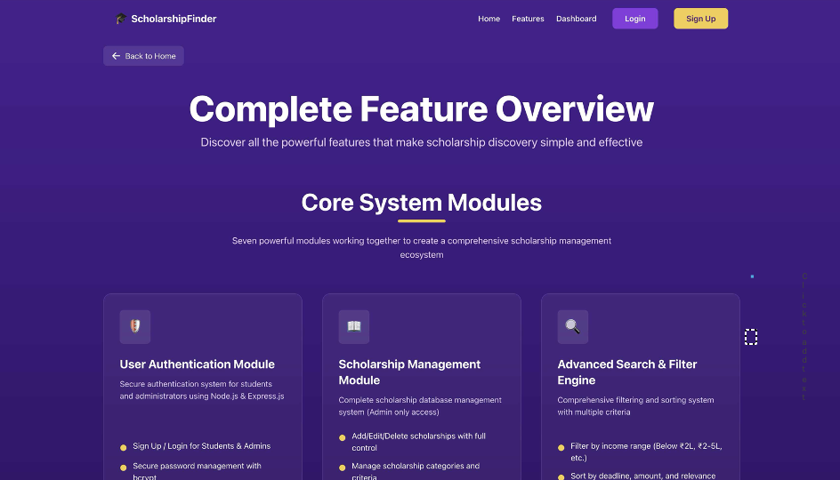

# 🎓 Scholarship Finder

A full-stack web application that helps students discover, filter, and apply for scholarships through a simple and user-friendly interface. The platform also provides an admin dashboard to manage scholarships, users, and applications efficiently.

---

## 🚀 Features

### 👤 User Authentication
- Secure Student and Admin Login/Signup
- JWT Authentication
- Password Hashing using bcryptjs
- Role-based Access Control

### 🎓 Scholarship Search
- Search scholarships using keywords
- Advanced filtering by:
  - Category
  - Income Range
  - Academic Level
  - Gender
- View scholarship details
- Apply directly from the dashboard

### 📄 Application Management
- Track applied scholarships
- View application status
- Manage scholarship applications

### 👨‍💼 Admin Panel
- Manage Users
- Manage Scholarships
- View Student Applications
- Activate/Deactivate Users
- Promote/Demote Admins

### 📱 Responsive Design
- Modern UI built with Tailwind CSS
- Mobile Friendly
- Fast and Responsive Interface

---

# 🛠 Tech Stack

## Frontend

- React 18
- TypeScript
- Vite
- Tailwind CSS
- React Router DOM

## Backend

- Node.js
- Express.js
- MongoDB
- Mongoose
- JWT Authentication
- bcryptjs

---

# 📸 Application Screenshots

## 🏠 Home Page

The landing page introduces the Scholarship Finder platform, allowing students to easily explore available scholarships and access the login or registration pages.

<p align="center">

</p>

---

## ✨ Features Page

The Features page provides a complete overview of the system modules, including Authentication, Scholarship Management, Search & Filter Engine, and Application Tracking.

<p align="center">

</p>

---

## 🎓 Student Dashboard

Students can browse scholarships, filter them based on eligibility criteria, search by keywords, and apply directly through the dashboard.

### Dashboard Features

- Advanced Search & Filters
- Scholarship Listings
- Application Tracking
- User Dashboard Statistics

<p align="center">

</p>

---

## 👨‍💼 Admin Dashboard

The Admin Panel provides complete control over the application. Administrators can manage users, monitor scholarship applications, and maintain the platform.

### Admin Features

- User Management
- Scholarship Management
- Application Monitoring
- Search Users
- Activate/Deactivate Accounts
- Promote/Demote Users

<p align="center">

</p>

---

# 📂 Project Structure

```
scholar/
│
├── backend/
│   ├── server.js
│   ├── package.json
│   └── ...
│
├── src/
│   ├── components/
│   ├── pages/
│   ├── hooks/
│   ├── config/
│   └── main.tsx
│
├── screenshots/
│   ├── home.png
│   ├── features.png
│   ├── dashboard.png
│   └── admin-panel.png
│
├── render.yaml
├── package.json
└── README.md
```

---

# 🚀 Deployment (Render)

This project is configured for deployment on **Render**.

## Backend Service

### Configuration

- Environment: Node.js
- Build Command

```
cd backend && npm install
```

- Start Command

```
cd backend && npm start
```

### Environment Variables

```
NODE_ENV=production

MONGODB_URI=Your MongoDB Atlas Connection String

PORT=Automatically Set by Render
```

---

## Frontend Service

### Configuration

- Environment: Static Site

Build Command

```
npm install && npm run build
```

Publish Directory

```
dist
```

### Environment Variable

```
VITE_API_URL=https://your-backend.onrender.com
```

---

# 📦 Deployment Steps

## Step 1

Push your project to GitHub.

---

## Step 2

Create a MongoDB Atlas Cluster and copy the connection string.

---

## Step 3

Login to Render.

- Click **New**
- Select **Blueprint**
- Connect your GitHub Repository

---

## Step 4

Set Environment Variables.

Backend

```
NODE_ENV=production

MONGODB_URI=Your MongoDB Connection String
```

Frontend

```
VITE_API_URL=Backend URL
```

---

## Step 5

Deploy the project.

After deployment,

- Visit the frontend URL
- Test Login
- Test Signup
- Search Scholarships
- Apply for Scholarships
- Verify Admin Dashboard

---

# 💻 Local Development

## Prerequisites

- Node.js 16+
- MongoDB

---

## Backend

```
cd backend

npm install

npm run dev
```

---

## Frontend

```
npm install

npm run dev
```

---

## Backend (.env)

```
MONGODB_URI=mongodb://localhost:27017/scholarshipfinder

PORT=4000
```

---

## Frontend (.env)

```
VITE_API_URL=http://localhost:4000
```

---

# ⚠ Troubleshooting

## Backend Doesn't Start

- Verify MongoDB connection string
- Check environment variables
- Review Render logs

---

## Frontend Cannot Connect

- Verify VITE_API_URL
- Ensure backend is running
- Check CORS settings

---

## Build Errors

- Verify Node.js version
- Install dependencies
- Review build logs

---

# 💡 Render Tips

- Free services sleep after 15 minutes of inactivity.
- First deployment may take 5–10 minutes.
- Environment variables must be configured before deployment.
- Custom domains are available on paid plans.

---

# 🤝 Support

If you encounter deployment issues:

- Review Render Logs
- Verify MongoDB Connection
- Check Environment Variables
- Refer to Render Documentation

---

# 📄 License

This project is licensed under the **MIT License**.

---

# ⭐ If you like this project, don't forget to give it a Star!
